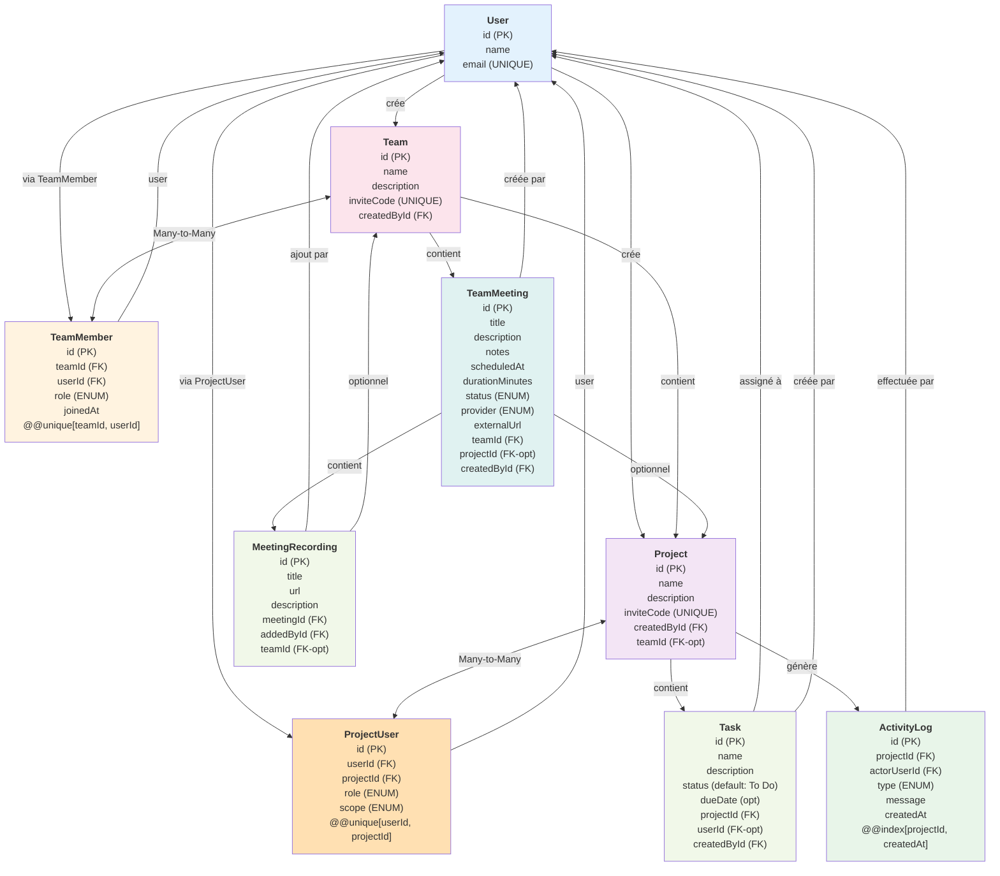
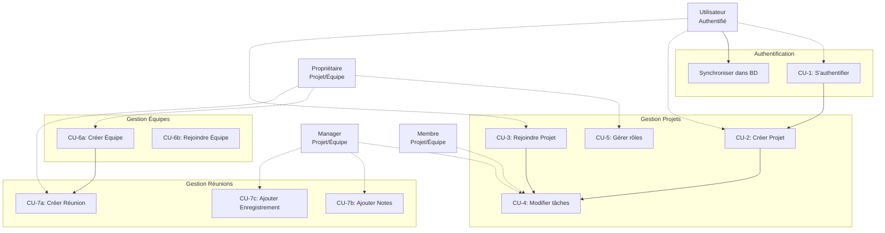
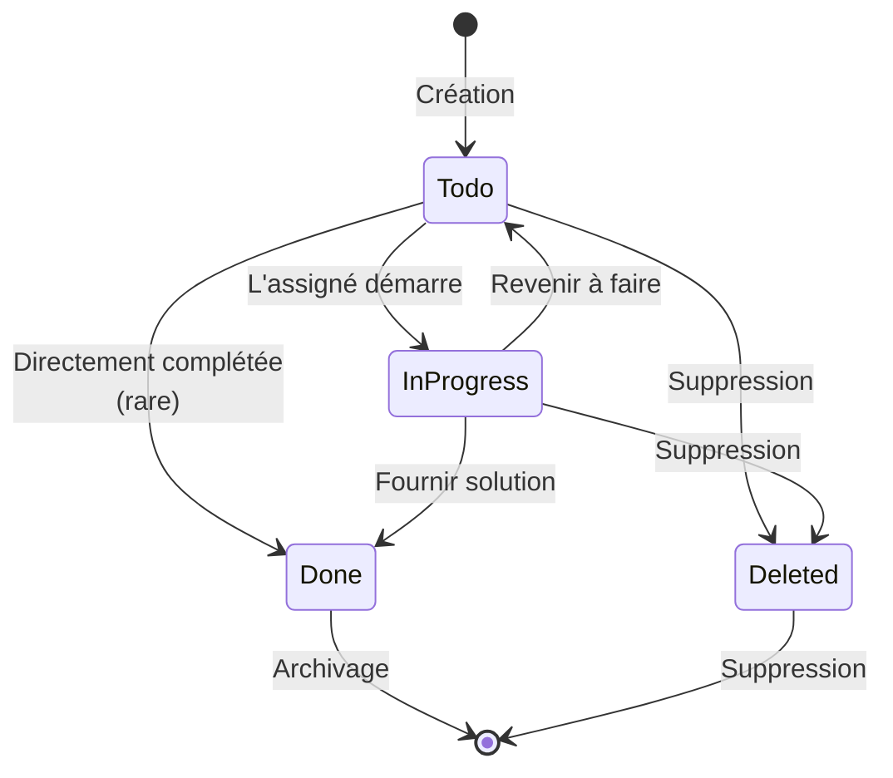
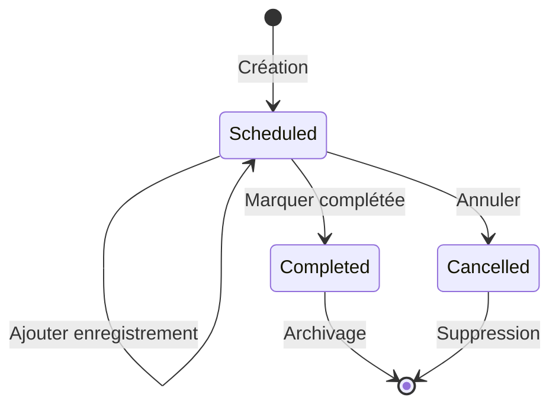
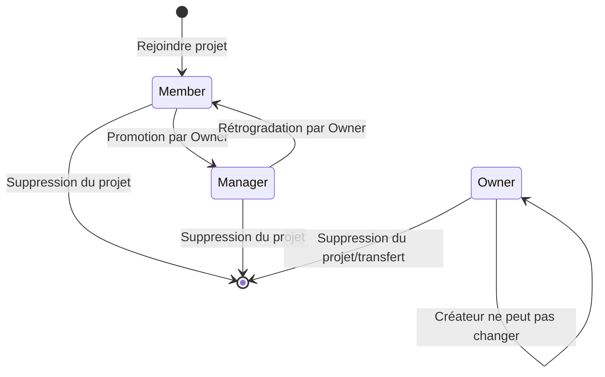

# Documentation Complémentaire - Relations, Flux et Cas d'Usage

**Document d'analyse avancée**  
**Sunu Projets - Gestion de Projet**

---

## Table des matières

1. [Relations de données détaillées](#relations-détaillées)
2. [Cas d'usage principaux](#cas-dusage)
3. [Diagrammes de cas d'usage](#diagrammes-cas-dusage)
4. [State Machines](#state-machines)
5. [Modèle d'intégration](#modèle-nintégration)
6. [Matrice de traçabilité](#matrice-de-traçabilité)

---

## Relations détaillées

### 1. Relation User ↔ Project

**Type** : Many-to-Many via ProjectUser

**Description** :
- Un utilisateur peut créer plusieurs projets
- Un utilisateur peut être membre de plusieurs projets
- La relation est gérée par la table `ProjectUser` qui stocke le rôle et la portée

**Kardinalité** :
```
User (N) ←→ (M) Project
         via ProjectUser
```

**Directionality** :
- User.id → ProjectUser.userId → Project
- User créé la relation quand il crée un projet (rôle OWNER)
- User rejoint une relation quand il utilise un inviteCode

**Contraintes** :
- `@@unique[userId, projectId]` : Un utilisateur ne peut avoir qu'un seul rôle par projet
- Suppression User → Supprime toutes les associations ProjectUser (cascade)
- Suppression Project → Supprime toutes les associations ProjectUser (cascade)

**Données liées** :
```typescript
ProjectUser {
  role: OWNER | MANAGER | MEMBER
  scope: INTERNAL | EXTERNAL
}
```

### 2. Relation User ↔ Team

**Type** : Many-to-Many via TeamMember

**Description** :
- Un utilisateur peut créer plusieurs équipes
- Un utilisateur peut être membre de plusieurs équipes
- La relation est gérée par la table `TeamMember`

**Kardinalité** :
```
User (N) ←→ (M) Team
         via TeamMember
```

**Directionality** :
- User crée une Team (createdById)
- User rejoint une Team via TeamMember (rôle OWNER à la création)

**Contraintes** :
- `@@unique[teamId, userId]` : Un utilisateur ne peut avoir qu'un seul rôle par équipe
- Suppression User → Supprime toutes les memberships (cascade)
- Suppression Team → Supprime toutes les memberships (cascade)

### 3. Relation Project ↔ Team

**Type** : One-to-Many (optionnel)

**Description** :
- Un projet peut être attaché à une équipe (optionnel)
- Une équipe contient plusieurs projets
- Un projet créé seul a `teamId = NULL`
- Un projet peut être lié à une équipe après sa création

**Kardinalité** :
```
Team (1) ←→ (0..M) Project
```

**Directionality** :
- Project.teamId → Team.id
- Lien établi via `attachProjectToTeam(projectId, teamId)`

**Contraintes** :
- Suppression Team → Définit Project.teamId = NULL (SetNull)
- Un projet ne peut appartenir qu'à une seule équipe

**Vérifications** :
```typescript
// Quand on lie un projet à une équipe
if (project.teamId !== null) {
  // Le projet doit être trouvé dans l'équipe
  // Vérification dans getTeamDetails()
}
```

### 4. Relation Project ↔ Task

**Type** : One-to-Many

**Description** :
- Un projet contient plusieurs tâches
- Une tâche appartient à exactement un projet
- Suppression du projet supprime toutes les tâches

**Kardinalité** :
```
Project (1) ←→ (1..M) Task
```

**Directionality** :
- Task.projectId → Project.id (FK)

**Contraintes** :
- Suppression Project → Supprime tous les Task (OnDelete: Cascade)
- Une tâche ne peut pas exister sans projet

### 5. Relation Task ↔ User (Assignation)

**Type** : Many-to-One (optionnel)

**Description** :
- Une tâche peut être assignée à un utilisateur (optional)
- Un utilisateur peut avoir plusieurs tâches assignées
- Una tâche est toujours créée par un utilisateur (createdById)

**Kardinalité** :
```
Task (N) → (0..1) User   [assignation]
Task (N) → (1) User      [créateur]
```

**Directionality** :
- Task.userId → User.id (optionnel, nullable)
- Task.createdById → User.id (obligatoire)

**Vérifications de sécurité** :
```typescript
// Avant d'assigner une tâche
const assignedUser = await prisma.user.findUnique({
  where: { email: parsed.assignToEmail }
});

// Vérifier que cet utilisateur est bien membre du projet
const hasAccess = await prisma.project.findFirst({
  where: {
    id: parsed.projectId,
    OR: [
      { createdById: assignedUser.id },
      { users: { some: { userId: assignedUser.id } } }
    ]
  }
})

if (!hasAccess) throw ActionError("L'utilisateur assigné n'appartient pas au projet");
```

### 6. Relation Team ↔ TeamMeeting

**Type** : One-to-Many

**Description** :
- Une équipe peut avoir plusieurs réunions
- Une réunion appartient exactement à une équipe
- Suppression de l'équipe supprime toutes les réunions

**Kardinalité** :
```
Team (1) ←→ (1..M) TeamMeeting
```

**Directionality** :
- TeamMeeting.teamId → Team.id (FK)

**Contraintes** :
- Suppression Team → Supprime tous les TeamMeeting (OnDelete: Cascade)

### 7. Relation Project ↔ TeamMeeting

**Type** : One-to-Many (optionnel)

**Description** :
- Une réunion peut être liée à un projet optionnel
- Un projet peut avoir plusieurs réunions
- Si le projet est supprimé, la réunion existe toujours (SetNull)

**Kardinalité** :
```
Project (1) ←→ (0..M) TeamMeeting
```

**Directionality** :
- TeamMeeting.projectId → Project.id (FK, nullable)

**Contraintes** :
- Suppression Project → Définit TeamMeeting.projectId = NULL (OnDelete: SetNull)
- Vérification : Le projet doit appartenir à la même équipe que la réunion

### 8. Relation TeamMeeting ↔ MeetingRecording

**Type** : One-to-Many

**Description** :
- Une réunion peut avoir plusieurs enregistrements
- Un enregistrement appartient à exactement une réunion
- Suppression de la réunion supprime les enregistrements

**Kardinalité** :
```
TeamMeeting (1) ←→ (0..M) MeetingRecording
```

**Directionality** :
- MeetingRecording.meetingId → TeamMeeting.id (FK)

**Contraintes** :
- Suppression TeamMeeting → Supprime tous les MeetingRecording (OnDelete: Cascade)

### 9. Relation Project ↔ ActivityLog

**Type** : One-to-Many

**Description** :
- Un projet maintient un historique d'activité
- Les logs enregistrent les modifications au projet
- Les logs incluent le créateur de l'action (actorUserId)

**Kardinalité** :
```
Project (1) ←→ (1..M) ActivityLog
```

**Directionality** :
- ActivityLog.projectId → Project.id (FK)
- ActivityLog.actorUserId → User.id (FK)

**Contraintes** :
- Suppression Project → Supprime tous les ActivityLog (OnDelete: Cascade)
- Index sur (projectId, createdAt) pour queries optimisées

**Types d'activités** :
```
PROJECT_CREATED
MEMBER_JOINED
MEMBER_ROLE_UPDATED
MEMBER_REMOVED
TASK_CREATED
TASK_STATUS_UPDATED
TEAM_CREATED
TEAM_MEMBER_JOINED
TEAM_MEMBER_ROLE_UPDATED
TEAM_MEMBER_REMOVED
PROJECT_LINKED_TO_TEAM
```

### Graphe des relations complètes



---

## Cas d'usage

### CU-1 : S'authentifier et se synchroniser

**Acteurs** :
- Utilisateur Non Authentifié
- Système d'Auth (Clerk)
- Base de données

**Préconditions** :
- L'utilisateur a accès à l'URL de l'application
- Clerk est configuré

**Flux principal** :
1. Utilisateur accède à `/sign-in` ou `/sign-up`
2. Clerk affiche le formulaire d'authentification
3. Utilisateur entre ses identifiants
4. Clerk valide (OAuth provider ou Clerk account)
5. Application récupère les infos del'utilisateur
6. Application cherche l'utilisateur dans la BD
7. Si n'existe pas → Crée l'utilisateur
8. Si existe mais infos changées → Met à jour
9. Utilisateur redirigé vers le dashboard

**Postconditions** :
- Utilisateur authentifié et synchronisé dans la BD
- Session active

---

### CU-2 : Créer un projet personnel

**Acteurs** :
- Utilisateur Authentifié

**Préconditions** :
- Utilisateur est authentifié
- Utilisateur existe dans la BD

**Flux principal** :
1. Utilisateur clique "Nouveau Projet"
2. Formulaire demande : Nom, Description, Email du créateur
3. Utilisateur remplit et soumet
4. Application valide (Zod schema)
5. Application génère code d'invitation unique (12 hexa)
6. Application crée le projet dans la BD
7. Application crée association ProjectUser (OWNER, INTERNAL)
8. Application enregistre activité "PROJECT_CREATED"
9. Utilisateur voit le projet dans sa liste

**Postconditions** :
- Projet créé avec utilisateur en OWNER
- Code d'invitation généré et stocké
- Historique enregistré

**Cas d'erreur** :
- Utilisateur non trouvé dans la BD
- Validation échouée (nom vide, etc.)

---

### CU-3 : Créer une tâche et l'assigner

**Acteurs** :
- Créateur de tâche (OWNER, MANAGER ou MEMBER)
- Assigné optionnel (Si fourni)

**Préconditions** :
- Utilisateur est membre du projet
- Le projet existe

**Flux principal** :
1. Utilisateur accède au projet
2. Clique "Nouvelle tâche"
3. Remplit formulaire :
   - Nom (requis)
   - Description (optionnel)
   - Date limite (optionnel)
   - Assigné à (email, optionnel)
4. Application valide les données
5. Si assigné fourni :
   - Cherche l'utilisateur par email
   - Vérifie qu'il est membre du projet
   - Prépare et envoie email via Resend
6. Crée la Task dans la BD
7. Enregistre l'activité
8. Retourne la tâche créée

**Postconditions** :
- Tâche créée avec statut "To Do"
- Si assignée → Email envoyé à l'assigné
- Activité enregistrée

**Cas d'erreur** :
- Utilisateur n'est pas membre du projet
- Email assigné invalide
- Utilisateur assigné n'appart. pas au projet
- Erreur lors de l'envoi d'email (log warning, tâche créée)

---

### CU-4 : Modifier le statut d'une tâche

**Acteurs** :
- Assigné de la tâche
- Créateur de la tâche
- Propriétaire du projet

**Préconditions** :
- Tâche existe
- Utilisateur peut la modifier
- Utilisateur a accès au projet

**Flux principal** :
1. Utilisateur voit la tâche
2. Clique pour modifier le statut
3. Application affiche les options :
   - To Do
   - In Progress
   - Done
4. Utilisateur sélectionne
5. Si sélectionne "Done" :
   - Application demande "Description de solution"
   - Si pas de description → Erreur
   - Utilisateur entre la description
6. Application met à jour Task.status et Task.solutionDescription
7. Enregistre l'activité "TASK_STATUS_UPDATED"
8. Rafraîchit l'affichage

**Postconditions** :
- Statut de la tâche mis à jour
- Description de solution enregistrée (si Done)
- Activité enregistrée

**Cas d'erreur** :
- Utilisateur n'est pas autorisé
- Description manquante pour "Done"

---

### CU-5 : Gérer les rôles dans un projet

**Acteurs** :
- Propriétaire du projet (OWNER)
- Membres du projet à modifier

**Préconditions** :
- Utilisateur est OWNER du projet
- Membres existent dans le projet

**Flux principal** :
1. Propriétaire accède à "Paramètres" du projet
2. Voit liste des membres triés par rôle
3. Pour chaque membre (sauf OWNER) :
   - Peut voir le rôle actuel
   - Peut le changer en MANAGER ou MEMBER
   - Peut le retirer du projet
4. Si change rôle :
   - Application valide le nouveau rôle
   - Met à jour ProjectUser.role
   - Enregistre l'activité "MEMBER_ROLE_UPDATED"
5. Si retire :
   - Application supprime l'association ProjectUser
   - Enregistre l'activité "MEMBER_REMOVED"

**Postconditions** :
- Rôle mis à jour ou utilisateur retiré
- Activité enregistrée
- Affichage rafraîchi

**Cas d'erreur** :
- Tentative de modifier OWNER
- Tentative de retirer OWNER

---

### CU-6 : Créer une équipe et la gérer

**Acteurs** :
- Propriétaire d'équipe
- Autres membres

**Préconditions** :
- Utilisateur est authentifié

**Flux principal - Création** :
1. Utilisateur clique "Nouvelle équipe"
2. Remplit formulaire : Nom, Description
3. Application valide
4. Génère code d'invitation unique
5. Crée Team dans la BD
6. Ajoute créateur comme TeamMember (OWNER)
7. Redirige vers la page de l'équipe

**Flux principal - Adhésion** :
1. Utilisateur accède à page "Rejoindre équipe"
2. Entre le code d'invitation
3. Application cherche Team par inviteCode
4. Si trouve → Ajoute utilisateur comme TeamMember (MEMBER)
5. Redirige vers l'équipe

**Postconditions** :
- Équipe créée ou rejointe
- Utilisateur est member avec rôle approprié

---

### CU-7 : Créer et gérer une réunion

**Acteurs** :
- Propriétaire ou Manager d'équipe
- Membres ayant créé la réunion

**Préconditions** :
- Utilisateur est OWNER ou MANAGER de l'équipe
- L'équipe existe

**Flux principal - Création** :
1. Manager/Owner clique "Créer réunion"
2. Remplit formulaire :
   - Titre
   - Description
   - Date/heure
   - Durée (minutes)
   - URL externe (optionnel)
   - Lier à un projet (optionnel)
3. Si projet sélectionné → Vérifie qu'il appartient à l'équipe
4. Crée TeamMeeting dans la BD
5. Redirige vers détail de la réunion

**Flux principal - Modification** :
1. Manager voit la réunion
2. Peut :
   - Ajouter/modifier notes (compte-rendu)
   - Changer statut (SCHEDULED → COMPLETED/CANCELLED)
   - Ajouter des enregistrements
3. Pour ajouter un enregistrement :
   - Entre titre, URL, description
   - Application valide l'URL
   - Crée MeetingRecording

**Postconditions** :
- Réunion créée avec statut SCHEDULED
- Notes et enregistrements gérés
- Utilisation possible de Jitsi via URL

---

## Diagrammes cas d'usage

### Vue globale des cas d'usage



### Diagramme cas d'usage - Gestion Projet

```mermaid
casediagram
    actor User
    actor Owner
    actor Manager
    actor Member
    
    system "Système Gestion Projets"
    
    User --> (Créer Projet)
    User --> (Rejoindre Projet)
    (Rejoindre Projet) --> (Récupérer inviteCode)
    
    Owner --> (Gérer Rôles)
    Owner --> (Retirer Membres)
    Owner --> (Supprimer Projet)
    Owner --> (Lier à Équipe)
    
    Manager --> (Créer Tâche)
    Manager --> (Assigner Tâche)
    Manager --> (Modifier Statut)
    Manager --> (Voir Activité)
    
    Member --> (Créer Tâche)
    Member --> (Modifier Statut Tâche)
    Member --> (Voir Activité)
    
    (Assigner Tâche) --> (Envoyer Email)
    (Créer Tâche) --> (Enregistrer Activité)
    (Modifier Statut) --> (Enregistrer Activité)
    (Gérer Rôles) --> (Enregistrer Activité)
    (Retirer Membres) --> (Enregistrer Activité)
```

---

## State Machines

### SM-1 : État d'une Tâche



**États** :
- **To Do** : Tâche créée, en attente de démarrage
- **In Progress** : Tâche en cours de réalisation
- **Done** : Tâche complétée avec description de solution
- **Deleted** : Tâche supprimée (archived)

**Transitions** :
- To Do → In Progress : Mise à jour statut
- In Progress → To Do : Remise en faire
- In Progress/To Do → Done : Mise à jour statut + description solution requise
- Any → Deleted : Suppression par créateur ou propriétaire

---

### SM-2 : État d'une Réunion



**États** :
- **SCHEDULED** : Réunion planifiée, à venir
- **COMPLETED** : Réunion réalisée
- **CANCELLED** : Réunion annulée

**Transitions** :
- SCHEDULED → COMPLETED : Après réalisation
- SCHEDULED → CANCELLED : Annulation
- Notes et enregistrements peuvent être ajoutés dans l'état SCHEDULED

---

### SM-3 : Rôle d'un Utilisateur dans un Projet



**États** :
- **MEMBER** : Collaborateur de base
- **MANAGER** : Peut créer/modifier tâches
- **OWNER** : Contrôle complet

**Transitions** :
- MEMBER ↔ MANAGER : Par OWNER uniquement
- OWNER → ? : Non modifiable (ownership ne se transfère pas)
- Any → Removed : Suppression du projet

---

## Modèle d'intégration

### Services externes utilisés

```mermaid
graph TB
    App["Application<br/>Next.js 16"]
    
    Clerk["Clerk<br/>Authentification"]
    Resend["Resend<br/>Email Service"]
    Jitsi["Jitsi<br/>Vidéoconférence"]
    DB["MySQL<br/>Prisma"]
    
    App -->|authenticate/<br/>session| Clerk
    App -->|user.id<br/>email| Clerk
    
    App -->|email.send()| Resend
    App -->|email params<br/>template| Resend
    Resend -->|SMTP| Email["Service Email"]
    
    App -->|reference URL| Jitsi
    Jitsi -->|meeting link<br/>stream| Client["Navigateur Client"]
    
    App -->|query/mutation| DB
    DB -->|data model<br/>relations| App
    
    style Clerk fill:#f5f5f5,stroke:#333
    style Resend fill:#f5f5f5,stroke:#333
    style Jitsi fill:#f5f5f5,stroke:#333
    style DB fill:#e8f5e9,stroke:#333
    style App fill:#e3f2fd,stroke:#333
```

### Points d'intégration critiques

#### 1. Authentification (Clerk)
- **Endpoint** : `POST /auth/`
- **Format réponse** : JWT Token
- **Données utilisateur** : email, name, id
- **Middleware** : `proxy.ts` → Routes protégées

#### 2. Envoi d'emails (Resend)
- **Endpoint** : `POST https://api.resend.com/emails`
- **Déclenchement** : Quand tâche assignée à autre utilisateur
- **Template** : HTML + text generateépar la fonction `sendTaskAssignmentEmail()`
- **Variables environnement** : `RESEND_API_KEY`, `EMAIL_FROM`, `APP_BASE_URL`

#### 3. Réunions vidéo (Jitsi)
- **Type** : V1 - Reference URL uniquement
- **Format** : `https://meet.jitsi.com/<room-name>`
- **Room ID** : Généré par `buildJitsiRoomName()` (slug + suffix aléatoire)
- **Stockage** : URL sauvegardée dans `TeamMeeting.externalUrl`
- **Provider** : Enum `MeetingProvider.JITSI`

#### 4. Base de données (Prisma + MySQL)
- **ORM** : `@prisma/client`
- **Provider** : MySQL
- **Migrations** : Via `prisma migrate dev`
- **Seed** : Via `prisma db seed` (si défini)

---

## Matrice de traçabilité

### Mappage Acteurs → Cas d'usage

| Cas d'usage                   | User | Owner Project | Manager Project | Member Project  | Owner Team | Manager Team | Member Team |
|-------------------------------|:----:|:-------------:|:---------------:|:---------------:|:----------:|:------------:|:-----------:|
| CU-1: S'authentifier          |  ✅  |      ✅      |       ✅        |       ✅       |     ✅     |      ✅     |     ✅      |
| CU-2: Créer Projet            |  ✅  |      ✅      |       ✅        |       ✅       |     ✅     |      ✅     |     ✅      | 
| CU-3: Rejoindre Projet        |  ✅  |      ✅      |       ✅        |       ✅       |     ✅     |      ✅     |     ✅      |
| CU-4: Modifier Tâche          |  ❌  |      ✅      |       ✅        |       ✅       |     ❌     |      ❌     |     ❌      |
| CU-5: Gérer Rôles             |  ❌  |      ✅      |       ❌        |       ❌       |     ❌     |      ❌     |     ❌      |
| CU-6a: Créer Équipe           |  ✅  |      ✅      |       ✅        |       ✅       |     ✅     |      ✅     |     ✅      |
| CU-6b: Rejoindre Équipe       |  ✅  |      ✅      |       ✅        |       ✅       |     ✅     |      ✅     |     ✅      |
| CU-7a: Créer Réunion          |  ❌  |      ✅*     |       ✅*       |       ❌       |     ✅     |      ✅     |     ❌      |
| CU-7b: Ajouter Notes          |  ❌  |      ✅*     |       ✅*       |       ❌       |     ✅     |      ✅     |     ❌      |
| CU-7c: Ajouter Enregistrement |  ❌  |      ✅*     |       ✅*       |       ❌       |     ✅     |      ✅     |     ❌      |

\* Si la réunion est liée au projet

### Mappage Entités → Permissions

| Entité | Read | Create | Update | Delete |
|--------|:----:|:------:|:------:|:------:|
| Project | MEMBER+ | OWNER | OWNER | OWNER |
| Task | MEMBER+ | MEMBER+ | CREATOR/OWNER | OWNER |
| ProjectUser | MEMBER+ | OWNER | OWNER | OWNER |
| Team | MEMBER+ | CREATOR | OWNER | OWNER |
| TeamMember | MEMBER+ | OWNER | OWNER | OWNER |
| TeamMeeting | MEMBER+ | MANAGER+ | MANAGER+ | OWNER |
| ActivityLog | MEMBER+ | AUTO | NONE | NONE |

### Mappage Enums → Utilisation

| Enum | Valeurs | Utilisation |
|------|---------|-------------|
| ProjectRole | OWNER, MANAGER, MEMBER | Dans ProjectUser |
| TeamRole | OWNER, MANAGER, MEMBER | Dans TeamMember |
| ProjectCollaboratorScope | INTERNAL, EXTERNAL | Dans ProjectUser |
| MeetingStatus | SCHEDULED, COMPLETED, CANCELLED | Dans TeamMeeting |
| MeetingProvider | NONE, JITSI | Dans TeamMeeting |
| ActivityType | 11 types | Dans ActivityLog |

---

## Annexe : Vérifications de sécurité

### Ordre de vérification recommandé

```
1. Vérifier que l'utilisateur est authentifié (Clerk)
2. Récupérer l'utilisateur de la BD (getCurrentDbUser)
3. Valider l'entrée utilisateur (Zod schema)
4. Vérifier l'accès à la ressource (proj/team membership)
5. Vérifier le rôle (si action restrictive)
6. Exécuter l'action
7. Enregistrer l'activité (si applicable)
8. Retourner le résultat ou l'erreur
```

### Checklist pour nouvelles fonctionnalités

- [ ] Authentification requise ? (middleware Clerk)
- [ ] Schéma Zod pour validation ? 
- [ ] Vérification de membership ?
- [ ] Vérification de rôle ?
- [ ] Erreur ActionError appropriée ?
- [ ] Activité enregistrée ?
- [ ] Tests unitaires ?
- [ ] Tests de sécurité ?

---

## Conclusion

Ce document complète l'analyse principale en détaillant :
- Les relations complexes entre entités
- Les cas d'usage complets
- Les machines d'état pour les workflows
- L'intégration avec les services externes
- La traçabilité entre acteurs et fonctionnalités

**La plateforme Sunu Projets dispose d'une architecture cohérente et sécurisée, avec des patterns bien établis pour la gestion des permissions et l'intégrité des données.**
